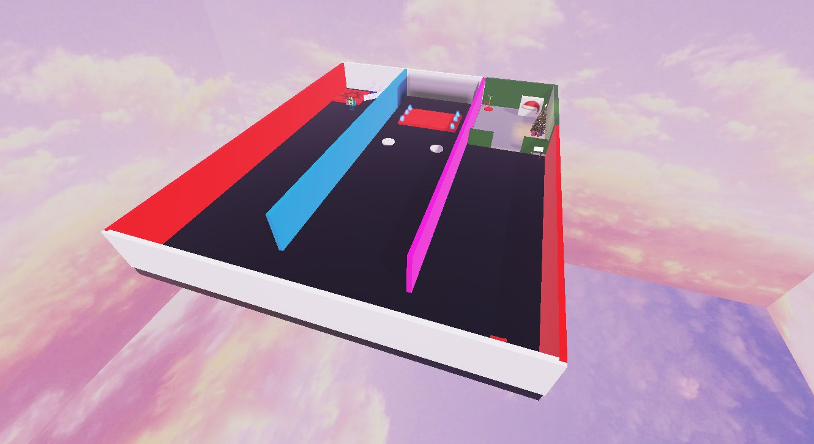
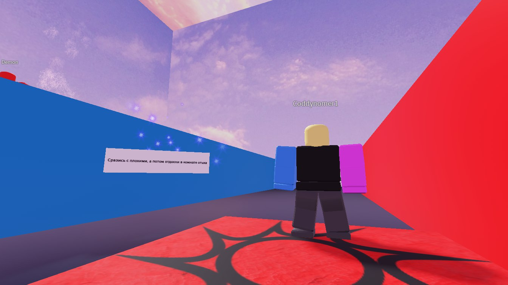
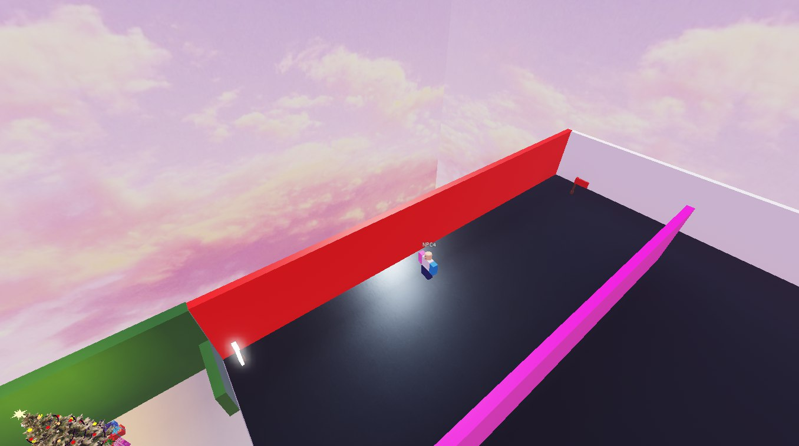
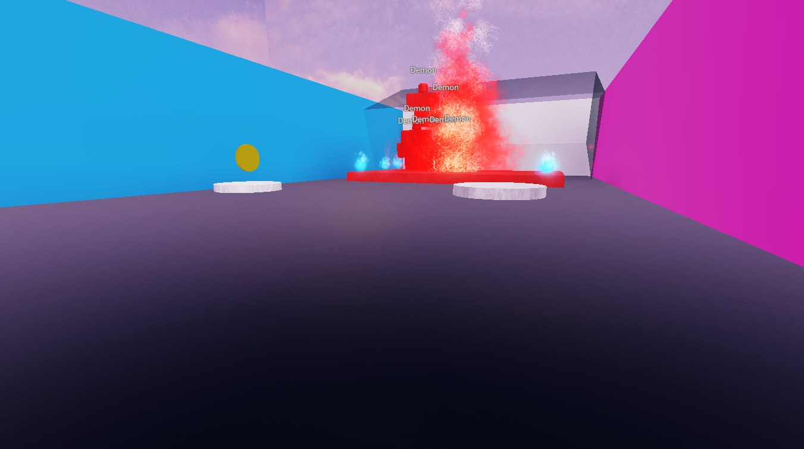
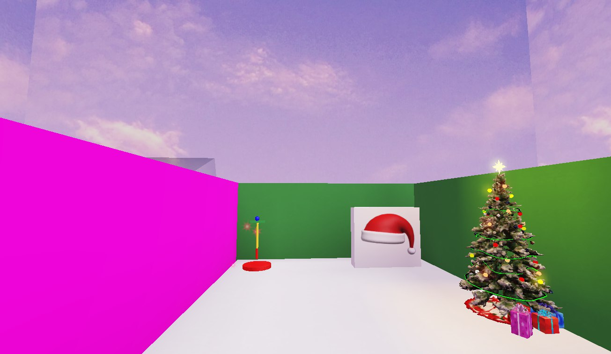
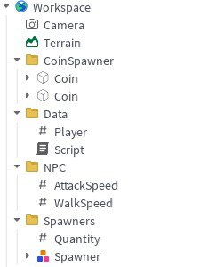
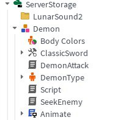
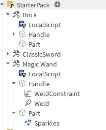

# Описание проекта

**Название игры:** "Battlefield"

**Жанр:** Action / Survival

**Платформа:** Roblox Studio

**Ссылка на игру:** 

**Цель проекта:** Игра предлагает игрокам динамичный процесс прохождения заданий и испытаний, проверяя их навыки выживания и стратегического мышления.

**Особенности игры:**
Игрок попадает на карту, где главной задачей становится победа над десятью врагами. В игре реализован механизм перемещения NPC между заданными точками карты, а все игроки имеют один и тот же скин. При приближении героя к месту спавна генерируется десять противников. В специальных зонах появляются монетки, причем ведётся учёт заработанных монет и числа уничтоженных врагов в общем лидерборде. Третья комната хранит специальный инструмент, позволяющий взлететь над картой.

---
# Скриншоты проекта

| Папки в Workspace | Папки в ServerStorage | Папки в StarterPack|
|----------|--------|--------|
|  |  |  
